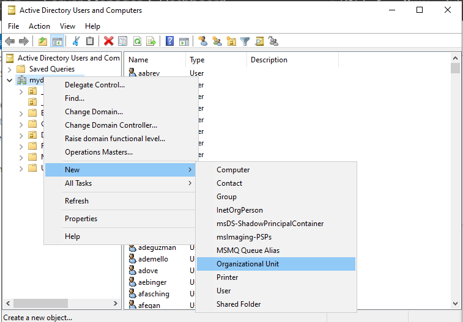
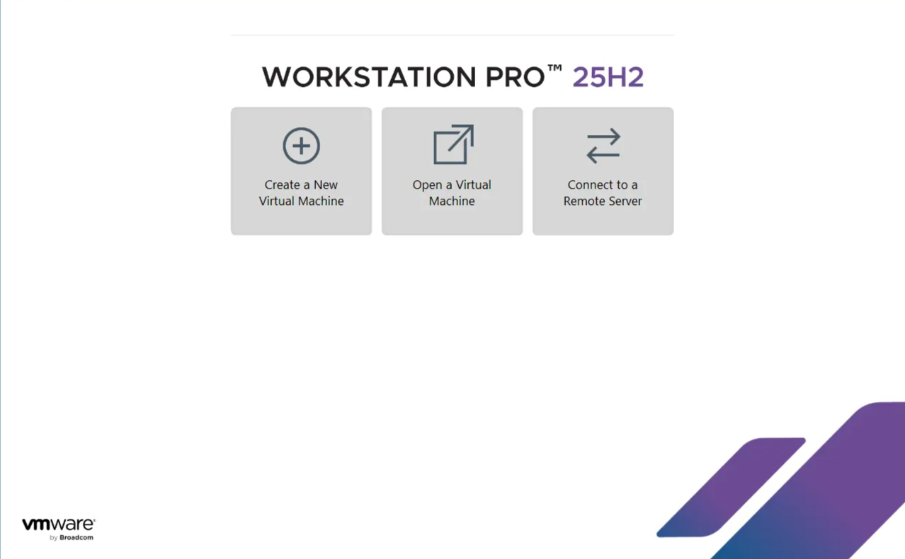
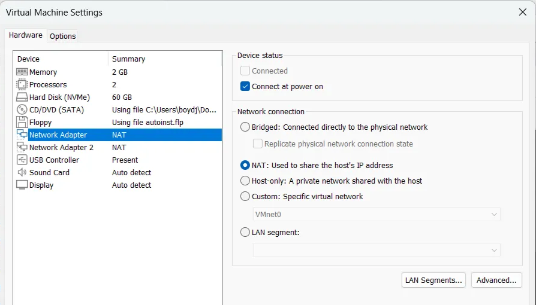
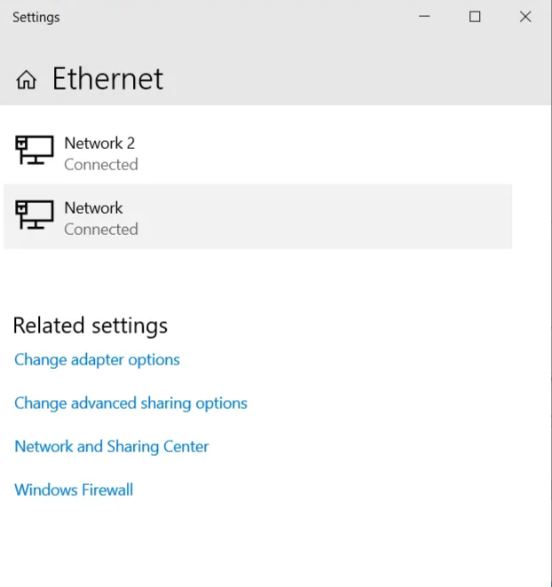
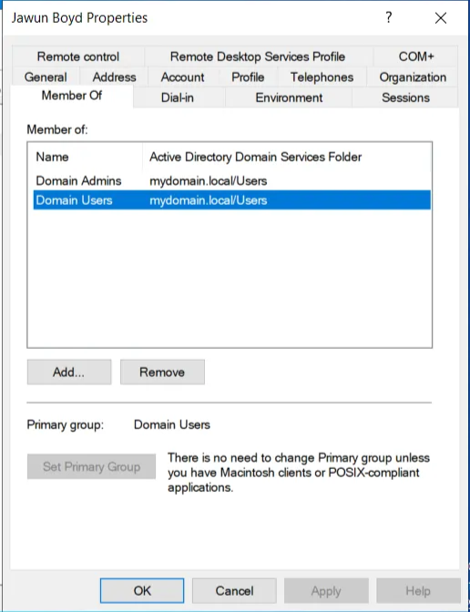

# 🔬 Active Directory Home Lab Setup(System Administration)
This diagram shows an overview of the setup of the home lab:

- The Domain Controller with two adapters, one for the outside internet and one for a private network for the clients to connect to. The Domain Controller will also have RAS/NAT set up for clients to access the internet through the Domain Controller. Also, DHCP is set up to provide IP Addressing to clients accessing the internet
- Windows 11 client, with an adapter connected to the Domain Controller's private network

# **Description**

This project demonstrates my expertise in system architecture, domain management, and building/managing complex network environments through a hands-on Active Directory (AD) Home Lab setup using VMware Virtualization Software.The follwing procedure involves configuring Microsoft Windows Server 2022 to host Active Directory Domain Services (AD DS) and deploying a Domain Controller (DC). A PowerShell script is utilized to automate the creation and addition of 1,000 users to AD, highlighting efficient administrative task automation. Following DC deployment, a Windows 11 Pro Virtual Machine is created as CLIENT1, configured with appropriate network settings, and joined to the domain. The next step is logging into CLIENT1 using one of the script-generated domain user accounts, simulating a basic corporate network environment. The setup culminates as CLIENT1 is logged into using a created user to administer group policies and enforce delegation privileges for organizational units created in Active Directory. This project serves as a practical showcase for networking and AD administration skills.

# **Objectives**

- Download and install VMWare
- Download Windows 11 ISO and Windows Server 2022 ISO to install the two operating systems on two seprate virtual machines

**Create the First Virtual Machine**

- The Domain Controller(DC), which is going to host Active Directory
- Two network adapters
    - one connects to the outside internet
    - The other used to connect to the DC's private network that CLIENT1 is going to connect to
- Install Server 2022 and assign IP addressing for the internal network, name the server, install Active Directory and create the Domain
- Configure NAT and routing so the clients on the private network can reach the internet through the DC
- Setup DHCP on DC so when CLIENT1's Virtual Machine is created and added to the network, it can automatially get an IP address
- Run Powershell script to create 1000+ users in the in the Active Directory automatically

**Create the Second Virtual Machine**

- Install Windows 11 ISO
- Connect Windows 11 Virtual Machine to private DC’s network
- Name the machine “CLIENT1” and join it to the domain
- Then log into CLIENT1 w/ a created domain account

**Group Policy Objects & Organizational Units(OUs)**
- Create Organizational Units for mydomain.local
- Delegate password resetting privileges of the created Organizational Units to a user
- Create and administer group policies to Organizational Unit and verifying that the policy works correctly

# **Prerequisites + Tools**

- Install VMWare(https://www.vmware.com/products/desktop-hypervisor/workstation-and-fusion)
- Install Windows 11 ISO(https://www.microsoft.com/en-us/software-download/windows11)
- Install Windows Server 2022(https://www.microsoft.com/en-us/evalcenter/evaluate-windows-server-2022)
- Powershell
- Active Directory
- CMD
- RSAT: Active Directory Domain Services and Lightweight Directory Services Tools

# Virtual Machine 1(Windows Server 2022)

- Open VMware application and click “Create a New Virtual Machine”

- Select the recommended configuration and click Next >
- Select the Windows Server 2022 ISO file and click Next >

- Change the Virtual Machine’s name to “DC”

- Leave the Disk Capacity as it is , 60.0 GB and click Next >, then click finish
- My Virtual Machine only has one adapter, two is needed for the outside internet connetion and private internet connection for the clients
- To add another adapter, click "Edit virtual machine settings"

- Click “Add…”, then select Network Adapter and click Finish
- Select NAT for the first Network Adapter and VMnet0 for the second Network Adapter, then click Ok
- I also removed the Floppy disk drive

### NAT Adapter Selected

### VMnet0 Adapter Selected

- Click “Power on this virtual machine”
- I used Windows Server 2022 Standard Evaluation (Desktop Experience)
- Select “Custom: Install Microsoft Server Operating System only (advanced)"
    - Click “New” , then “Apply”, then click Ok
    - After partitioning the drive, click Next

- After partitioning the drive, allows the machine to restart and set an Administrator Password
- Log in with Administrator password
> May Have to install VMware tools

### Locating NAT Adapter

- Select “Change adapter options”

- I have to figure out which Network Interface Card(NIC) serves as Network Access Translator(NAT) and name the two adapters appropriately
    - Right clicking an adapter then clicking “Status”, the click “Details”. Reveals IP Addressing information
    - Ethernet0 is the NAT adapter because it’s DNS is assigned to “localdomain”

### Renaming PC

- Right click the Windows icon on the bottom left of the screen, click System
- Click “Rename this PC” and add a name for the PC. I chose DC for Domain Controller

### Give IP Address to X_internal_X Adapter

- View the properties of the X_internal_X adapter, then click “Internal Protocol Version 4 (TCP/IPv4)"

- Select “Use the following IP address”. I used the IP address from the diagram(172.16.0.1). Also I omit the “Default Gateway” because the Domain Controller serves as the gateway. Used a loopback address(127.0.0.1) to use the Domain Controller as the DNS. Then click OK

### Install Active Directory Domain Service

- In the Server Manager click “Add Roles and Features”

- Select “Role-based or feature-based installation” for Installation Type and select the recently created Server (DC) in the Server Selection section

- For the Server Roles section, select “Active Directory Domain Services” then click Add Features

- Click Next > until you get to the Confirmation section and click “Install”. Be patient as it takes some time to install, then click Close when the installation process is finished

- After completing the installation process, the Active Directory Domain Services software is now downloaded, now the Domain needs to be created. On the Server Manager click the flag at the top with the yellow triangle

- Click “Promote this server to a domain”

- Select “Add a new forest”. Specify the root domain name for the Domain. I used “mydomain.local”

- Type the Password for your Domain Controller in the Domain Controller Options section then click Next >

- In the Additional Options section, wait for the NetBIOS name to generate for the Domain and click Next > until getting to the Prerequisites Check section and wait until the check is passed and click Install. After the installation, my computer Virtual Machine restarted and I logged back in with my Administrator account

### Create my own Domain Admin Account

- I am going to create my own Domain Admin account instead of using the builtin Administrator account
- Click Start > Windows Administrative Tools > Active Directory Users and Computers

- Create and Organizational Unit for the Admin account that is being created. Think of the Organizational Unit as a folder used for our Admin account
- Click right mydomain.local > New > Organizational Unit

- Give a name to the Organizational Unit

- Once the Organizational Unit is created, it will be added to the list of folders under mydomain.local. Now create a new user in the Organizational Unit
- Right click mydomain.local > New > User

- Fill in the info for the new user including first name, last name, and User logon name. I used a-jboyd to signify that this is an admin account, then click Next > and enter the password for the user

- I selected the “Password Never Expires” box to refrain from dealing with the password during this Lab then click Next >, then Finish

- Although the user is created and has an a- in the username it is still not an admin yet. To make it a domain admin, right click the created user > Properties > Member Of. Click “Add…” and type “Domain Admins”

- Click the “Check Names” button then click OK
- Then click Apply on the “Members Of” menu, then click OK

- Now I have my own Domain Admin account
- After creating the Domain Account I signed out of the Builtin Administrator account and signed in using the created Domain Admin Account

### Create RAS(Remote Access Services)/NAT(Network Address Translation)

- The creation of RAS/NAT allows our Windows 11 client to be on a private virtual network, but still be able to access the internet through the Domain Controller
- In there Server Manager, click “Add roles and features”. Select “Role-based or feature-based installation” for installation type
- Select the Server in the Server Selection section and click Next >

- Select “Remote Access” in the Server Roles section then click Next >

- Click Next > until the “Role Services” section. Select “Routing” from the list of services, then click Add Freatures

- I clicked Next > until it got to the Confirmation section and clicked Install. Wait on the installation, then click Close
- On the Server Manager click Tools> Routing and Remote Access

- Right click the Domain > Configure and Enable Routing and Remote Access

- Click Next > once the Setup Wizard pops up
- Select “Network address translation(NAT) to allow clients to the internet. Click Next >

- Select “Use this Public interface to connect to the Internet” and click the “_INTERNET_” interface. This is why it was important to name the Adapters to be able to tell the difference between public and private interfaces

- After clicking Finish, there was a pop up, I pressed OK

- Wait until the Remote Access Service finished initializing

- Now I have my Domain, set up along with RAS and NAT

### Setting up DHCP Server on Domain Contoller

Allows Windows 11 Clients to automatically get an IP address that will let them access the internet even though they are on this private internal network. I will create a scope to give IP Addresses in a defined range.

- In Server Manager click Add roles and features
- Select “Role-based or feature-based installation” for installation type, select the correct Domain in the Server Selection section
- In the Server Roles section, select DHCP Server and AD Features

- Click Next > until the Confirmation section, then click Install, wait for the installation, then click Close
- In the Server manager select Tools > DHCP

- Right click IPv4 and click “New Scope…”, click Next > and name the scope. I named the scope after the range I am using for the IP Addresses

- Click Next > and clarify the Start and Stop IP Addresses for the DHCP and give the network a mask of /24, click Next >

- No Exclusions were added, click Next >. Set the duration for how long a client can have their assigned IP address before it needs to be refreshed. I set it to 8 days. So after 8 days, of the client having an IP Address, it will need to be refreshed. Click Next >

- Select “Yes, I want to configure these options now” to configure DHCP options for the scope. This allows me to tell the Clients which server to use for the Gateway Router. In this demonstration, the clients will use the internal NIC on the Domain Controller as their default Gateway/ Router. I enter the Domain Controller IP Address and click “Add” then Next >

- I chose my domain the I created (mydomain.local) as my parent domain and clicked Next > until I was asked about Activating the scope and I selected “Yes, I want to activate this scope now”, then Next >, then Finish

- Now I have to authorize the server and refresh. Right click the DC > Authorize, then right click the DC again, and click refresh

- Now the scope I created is under the IPv4 section

- There are no Address Leases yet because I haven’t created the client computer yet

### Use PowerShell Script to create Users in Active Directory

- First, I have to make a configuration that lets me browse the internet from the Domain Controller. This is usually not done in a production environment, this is only done for lab purposes
- In the Server Manager, click “Configure this local server”

- Click “On” at “IE Enhanced Security Configuration”. Then select off for both Administrators and Users. This disables the security features on the Domain Controller to be able to retrieve my PowerShell script from the internet

- Next, download the PowerShell script with this link on the Domain Controller Virtual Machine by pasting this link in the Domain Controller web browser: [https://github.com/joshmadakor1/AD_PS/blob/master/Generate-Names-Create-Users.ps1](https://github.com/joshmadakor1/AD_PS/blob/master/Generate-Names-Create-Users.ps1) and downloading the zip file, then extract the files

- Click the names.txt file in the folder and I added my name at the top of the names.txt file name list and saved it

- Click Start > Windows PowerShell > Windows PowerShell ISE and select to run it as administrator

- Inside Windows PowerShell ISE, go to the folder icon in the top taskbar

- Go to the location of the downloaded PowerShell script and select 1_CREATE_USERS

- Before running this PowerShell script, I have to enable the execution of all scripts. Do this by typing: Set-ExecutionPolicy Unrestricted and press enter and select “Yess to All” for the Execution Policy Change pop up . This is for lab purposes only as this is a security feature for the Domain Controller

- To run, path has to be defined to locate the PowerShell script. Change Directory into the script file
- After locating the file, click enter to run it and click “Run Once” at the Security Warning

- After the script has finished, I look on “Active Directory Users and Computers” and there are alot of users that was created from that PowerShell script that I ran

- The script ran fine, but there were a couple of errors because of duplicate names that were on the list. This did not effect the script completing
- Also, right clicking _USERS > find.. I can search for users

# Virtual Machine 2(Windows 11 Pro)

Creating the second Virtual Machine for Windows 11

- Navigate to the home tab on VMWare and click “Create a New Virtual Machine”

- Select the recommended configuration type, then select the Window 11 ISO file

- Name the Virtual Machine: “CLIENT 1”

- Enter the password for the Virtual Machine, and the disk size(I left the size at the default size), then click finish
- Click “Edit virtual machine settings”
- Click “Network Adapter”, then select Custom. This disables NAT and restrict internet access in my local network. Windows 11  client can access the internet but only through getting an IP address from the Domain Controller. For this to happen, I configured this Virtual Machine on the same network as the Domain Controller Virtual Machine

- This picture of the internal network adapter from Windows Server 2022 set to VMnet0 corroborates that, the Windows 11 Virtual Machine is on the same network

- Select Windows 11 Pro

- A page popped up to name my device and I clicked “Skip for now”
- I also clicked to set up my device for Personal Use
- If the “How would you like to set up this device?” screen comes up, choose “Set up for work or school”

- Select “Sign in options” right below the email address bar

- Click “Domain join instead”

- For the “Who’s going to use this device” page, enter “user”, create a password for the user, and choose the security questions for the user

- I turned off all of the privacy settings for the the user account. This is done for lab testing purposes
- After setup, I ran ipconfig in the terminal to see that the IP Addressing the I set up with DHCP works and I am able to access the internet through the Domain Controller

- I can also ping my Domain Controller which shoes that there is indeed network connectivity between the Windows 11 and the Windows Server 2022 Virtual Machines

- I change the hostname of the Windows 11 system by right clicking the start menu > System. Then click rename

- After renaming, I restarted the system

### Joining Windows 11 to Windows Server 2022 (Domain Controller)

- Click on the Window’s Icon and search “domain” and click on “Access work or school” and click the “Connect” button

- Click “Join this device to a local Active Directory domain”

- Type in the name of the domain and click Next

- I used my Administrator Account that I previously made as credentials to join to the domain, and for account type I chose Administrator, then I restarted my system and logged back in as user a-jboyd

- Since I have Windows 11 Virtual Machine joined to the Domain Controller, I am able to view it in the Address Leases folder on the Domain Controller
- In the Server Manager click Tools > DHCP > dc.mydomain.local > IPv4 > Scope > Address Leases

- These leases are created after the DHCP server gives the client an IP Address
- The client computer is also visible in the computers folder under “Active Directory Users and Computers”
- In the Server Manager click Tools > Active Directory Users and Computers > mydomain.local > Computers

### Logging In as another user account

I am now logging in as another user account established within mydomain.local from running the PowerShell to check for proper configuration 

- Check the list of users on the Domain Controller and chose one to use
- I restarted Windows 11 to get back to the login screen. Click “Other user” for the sign in and enter the user’s credentials

- I change the user’s password to log in so that I will know the password for the acastleberry
- In the Server Manager, go to the list of users find one to use, and right click the user. Click “Reset Password”, change the password, then click OK

- Go back to the Windows 11 Virtual Machine and log on

- Running Whoami in the terminal, I can see that I am the user acstleberry and this user is a member of mydomain

# Organizational Units and Group Policies

# Organizational Units

>Organizational Units are used to define sets of users with similar policing requirements

In this scenerio I have a tech company, MyDomain, inc.  and different departments need to have different rules and restrictions. This will be done using Organizational Units, container objects that let you classify users and machines

# Creating Organizational Units

Now I create each individual Organizational Unit for the Management, Marketing, Sales, and IT departments for MyDomain, inc

- In the server manager on the Windows Server 2022 Virtual Machine click tools > Active Directory Users and Computers
- Right click mydomain.local > New > Organizational Unit

- Name the Organizational Unit

- I see that the Organizational Unit is added to mydomain.local

- Now create the other Organizational units for IT, Sales, and Marketing

### Adding Users to Each Organizational Group

I am adding users to each organizational group and delegating privileges

- Click _USERS, select a user to move. Right click the User and select “Move…”

- Click the Management Organizational Unit and click Ok. Here, I put user acastleberry in the Management Organizational Unit. Next, I fill the other organizational units with 3-4 users for each department

# Delegate Control over OU

>Delegation allows you to grant users specific privileges to perform advanced tasks on OUs without needing a Domain Administrator

Now that I have the Organizatonal Units created, I want to delegate the control of resetting user passwords for every department to users in the IT Department

- Right click the “Management” Organizational Unit > Delegate Control

- Click Next > when the Delegation of Control Wizard pops up, then click add to add the users of the IT Organizational Units

- I added a user’s name and clicked “Check Names” to verify the user, then click space and typed the other names with the same procedure and click Ok

- The list of users are shown that have been selected from the IT department. Click Next >

- Select “Reset user passwords and force password change at next logon”

- Click Next > then click Finish

### Verifying the Delegation

I log in as cdally, from the IT Organizational Group, on CLIENT 1 and reset the password for Beverley(btagg) from the Marketing Group. To be able to interact with the Active Directory from CLIENT1, I had to download RSAT:Active Directory Domain Services and Lightweight Directory Service Tools

>I had to be logged in as a local administrator for this computer to download RSAT. I logged in with my administrator account, downloaded it, and logged back in as cdally

- Settings > Apps > “optional features” in the search bar

- Click “View Features” > “See available features”
- Type RSAT in the search bar, look for RSAT: Active Directory Domain Services and Lightweight Directory Services Tools

- After downloading, I can type Active Directory in the search bar and it appears on my CLIENT1 machine

- Next, I open PowerShell and enter a command to force a new password reset for Beverley(btagg) at her next logon

>Make sure that the account used has Password never expires unchecked in the user account properties in Active Directory. Tools > Active Directory Users and Computers > Double Click User > Account Tab

- The next time Beverley logs in, she will be forced to reset her password

- I try to reset the password of a user that is not in an Organizational Unit that Carmelo(cdally) has delegation of and failed due to access denial, which shows the delegation process is working fine

- Carmelo also does not have access to move users to other Organizational Groups. Search: Active Directory Users and Computers > Click an OU > Right-Click a User > Move…
- As seen, Carmelo cannot move user btagg becasue he only has delegated permissions to change and reset her password

- I log out of Carmello’s account and to access Beverley’s I am prompted to enter a new password to enter, further verifying that the delegation for cdally works fine

# Group Policy Objects

Group Policy Objects(GPOs) are how Windows manages policies for different Organizational Units. Here, I’m going to create a Group Policy Object that blocks all non-IT Organizational Unit members from accessing the control panel on their machines

### Creating the Group Policy

- Go to Windows Server 2022 Virtual Machine > Search “Group Policy Management”

- Navigate to the “Group Policy objects” folder in mydomain.local and Right-Click > New > Enter a name for the Group Policy. I chose “Restrict Control Panel Access” and click OK

### Editing the Group Policy

- Right Click the GPO that was just created > Edit > User Configuration > Policies > Administrative Templates > Control Panel

- Double-click “Prohibit access to Control Panel and PC settings” to enable it

- Click “Apply” then OK. The restriction is shown here as “Enabled”

- Exit from the Group Policy Management Editor and go back to the Group Policy Objects folder. Copy the “Restrict Control Panel Access” GPO to the Marketing, Sales, and Management Organizational Units to enforce the rules to the group members

### Verifying Group Policy Object

Now I will log in as Beverley(btagg), a member of the Marketing Organizational Unit, and try to access the control panel on CLIENT1

- I received a restriction pop up that prevents Beverley from accessing the control panel due to the Group Policy Control Panel restrictions
